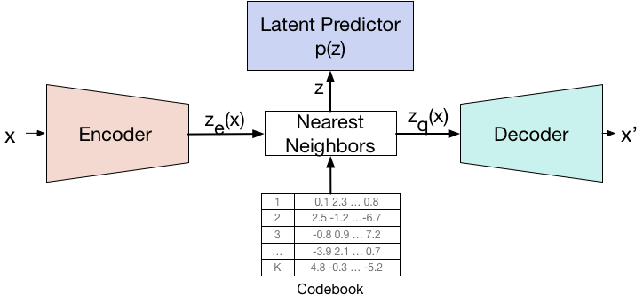

# VQ-VAE for the ADNI Dataset

**Author**: Connor Armstrong (s4703621)

# Project:

## The Vector Quantized Variational Autoencoder
The goal of this task was to implement a Vector Quantized Variational Autoencoder (henceforth referred to as a VQ-VAE). The VQ-VAE is an extension of a typical variational autoencoder that handles discrete latent representation learning - which is where the model learns to represent data in a form where the latent variables take on distinct discrete values, rather than a continuous range. This is done by the model passing the encoders output through a vector quantisation layer, mapping the continuous encodings to the closest vector in the embedding spacve. This makes the VQ-VAE very effective at managing discrete structured data and image reconstruction/generation.

## VQ-VAE Architecture

As shown above, the VQ-VAE is comprised of a few important components:

- **Encoder**: 
  The encoder takes in an input, represented by `x`, and compresses it into a continuous latent space resulting in `Z_e(x)`.

- **Latent Predictor p(z)**: 
  This is not necessarily an actual module as in most VQ-VAE architectures, this isn't explicitly present. However, it is useful to think that the latent space has some underlying probability distribution `p(z)` which the model tries to capture or mimic.

- **Nearest Neighbors & Codebook**: 
  One of the most important features of VQ-VAE is the use of a discrete codebook. Each entry in the codebook is a vector. The continuous output from the encoder (`Z_e(x)`) is mapped to the nearest vector in this codebook. This is represented by the table at the bottom. Each row is a unique vector in the codebook. The process of mapping `Z_e(x)` to the nearest codebook vector results in `Z_q(x)`, a quantized version of the encoder's output.

- **Decoder**: 
  The decoder takes the quantized latent representation `Z_q(x)` and reconstructs the original input, producing `x'`. Ideally, `x'` should be a close approximation of the original input `x`.

The use of a discrete codebook in the latent space (instead of a continuous one) allows the VQ-VAE to capture more complex data distributions with fewer latent variables. 

## VQ-VAE and the ADNI Dataset
The ADNI (Alzheimer’s Disease Neuroimaging Initiative) dataset is a collection of neuroimaging data, curated with the primary intent of studying Alzheimer's disease. In the context of the ADNI dataset, a VQ-VAE can be applied to condense complex brain scans into a more manageable, lower-dimensional, discrete latent space. By doing so, it can effectively capture meaningful patterns and structures inherent in the images.

## Details on the implementation
This implementation was relatively standard for this model. There exist other extensions that could be of a great use in this case, using a gan or other generative models in combination creates a powerful method to improve upon my implementation - but this is left forr other students with more time. 

# Usage:
**Please Note: Before running please add the directory to the train and test files for the dataset in 'train.py'**

It is highly reccomended to run only the 'predict.py' file by calling 'python predict.py' while in the working directory. It is possible to run from the 'train.py' file as well, but this has implications with data leakage a I could not find a proper way to partition the test set.

If all goes well, matplotlib outputs 4 images: the original and reconstructed brain with the highest ssim, and then the lowest ssim. 

# Data
This project uses the ADNI dataset (in the structure as seen on blackboard), where the training set is used to train the model, and the test folder is partitioned into a validation set and test set.

# Dependencies
| Dependency  | Version     |
|-------------|-------------|
| torch       | 2.0.1+cu117  |
| torchvision | 0.15.2+cu117|
| matplotlib  | 3.8.0       |

# Output
As stated earlier, these are the images with the highest and lowest ssim scores:

# References
The following sources inspired my implementation and were referenced in order to complete this project:
* Neural Discrete Representation Learning, Aaron van den Oord, Oriol Vinyals, Koray Kavukcuoglu, 2017. https://arxiv.org/abs/1711.00937
* Adni Brain Dataset, Thanks to https://adni.loni.usc.edu/
* Misha Laskin, https://github.com/MishaLaskin/vqvae/tree/master
* Aurko Roy et al., Theory and Experiments on Vector Quantized Autoencoders, https://www.arxiv-vanity.com/papers/1805.11063/