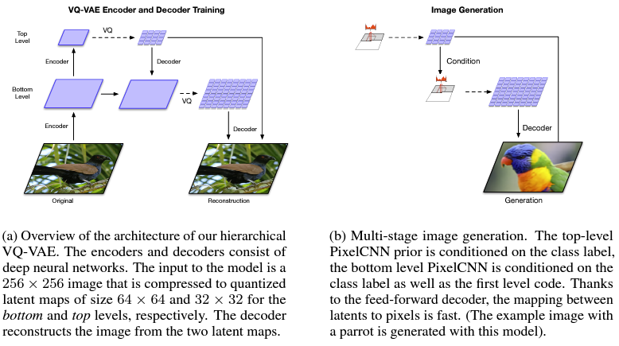
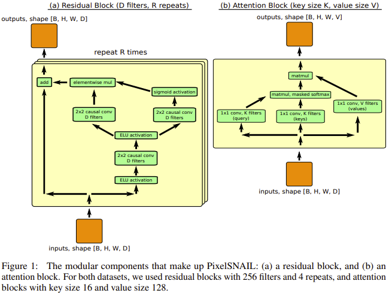
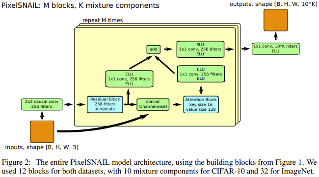
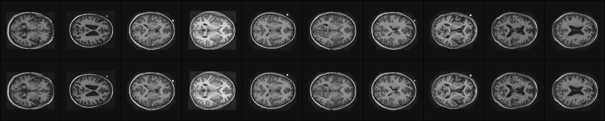
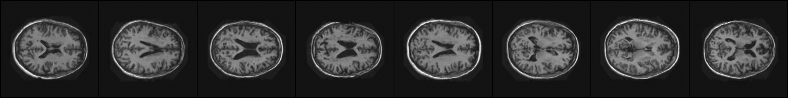

# Generative model of OASIS brain dataset using a VQ-VAE-2
Create a generative model of the OASIS brain using a VQ-VAE-2 that has a reasonably clear image and an SSIM of over 0.6.

This implementation trains a VQ-VAE based on convolutional layers and uses a PixelSNAIL prior to generate images.

Example outputs and plots of the images generated by the model are provided.

## Model architecture
### VQ-VAE-2 model
VQ-VAE-2 (Vector Quantized Variational Autoencoder 2) is a generative model builds upon VQ-VAE. This structure involves multiple levels (usually two) of encoding and decoding. Each level quantizes its representations into discrete codes. 

1. **Hierarchical Encoding** - Usually, there are two levels of encoders. The first encoder produces a set of "top" latent codes, and the second encoder produces a set of "bottom" latent codes

2. **Vector Quantization** - Each encoder's output goes through a vector quantization process. The continuous embeddings from the encoders are quantized into discrete values. The discrete values are chosen from a predefined codebook.

3. **Hierarchical Decoding** - A combination of top latent codes and bottom latent codes is fed to the decoder to reconstruct the image.

A diagram of this model is shown below [1].



### PixelSNAIL model
PixelSNAIL is a generative model builds upon PixelCNN. It uses autoregressive neural networks to generate data pixel-by-pixel in a raster scan order. By masking the convolutions, each pixel can only access information from earlier positions. It uses a self-attention mechanism to capture long-range dependencies in the data. It's often used in conjunction with other models like VQ-VAE-2, as PixelSNAIL can generate lower-level details based on higher-level latent codes.

A diagram of this model is shown below [2].




## Dataset
The OASIS brain dataset is provided by the course. It contains 9664 training images, 1120 validation images and 544 test images.

The size of these images is 256x256 and are greyscale with pixel values ranging from 0 to 255. 

Below are some training samples from the training data set.


## Implementation
### Dependencies
* python = 3.10.12
* pytorch = 2.0.1
* torchvision = 0.15.2
* cuda = 11.8
* numpy = 1.25.0
* matplotlib = 3.7.2
* scikit-image = 0.20.0
* pillow = 9.4.0

### Usage
Training:

Add your dataset path into dataset.py.

Run the following command to train the models (VQVAE, PixelSNAIL-top, PixelSNAIL-bottom).

```bash
$ python train.py --batch 64
$ python train.py --hier top
$ python train.py --hier bottom
```
Predicting:

Run the following command to reconstruct images (with SSIM) & generate images.

Images will be saved to "predict/".

```bash
$ python predict.py
$ python predict.py --generate True
```

## Results
### Reconstructure results
The original and reconstructed images by the VQ-VAE-2 model achieved an average SSIM of 97%. Visually the overall structures of the reconstructed images clearly resemble the original images. Below are some examples of reconstruction, with original images from the test set at the top, and respective reconstructions at the bottom.



### Generation results
The PixelSNAIL model has been used in conjunction with the VQ-VAE-2 model to generate images of brains. Below are some examples of generated images.



## References:
[1] A. Razavi, A. van den Oord, and O. Vinyals, “Generating Diverse High-Fidelity Images with VQ-VAE-2,” arXiv.org, Jun. 02, 2019. http://arxiv.org/abs/1906.00446

[2] X. Chen, N. Mishra, M. Rohaninejad, and P. Abbeel, “PixelSNAIL: An Improved Autoregressive Generative Model.” Available: https://arxiv.org/pdf/1712.09763.pdf

[3] “Sonnet,” GitHub, Oct. 22, 2023. https://github.com/google-deepmind/sonnet

[4] K. Seonghyeon (Matt), “vq-vae-2-pytorch,” GitHub, Oct. 20, 2023. https://github.com/rosinality/vq-vae-2-pytorch
‌