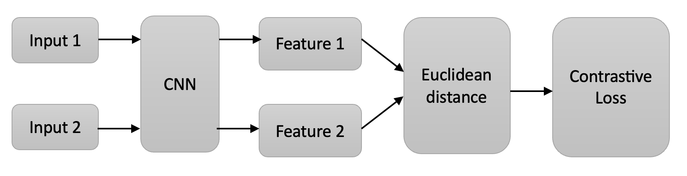
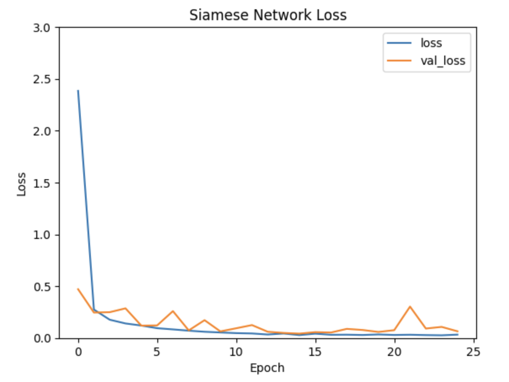
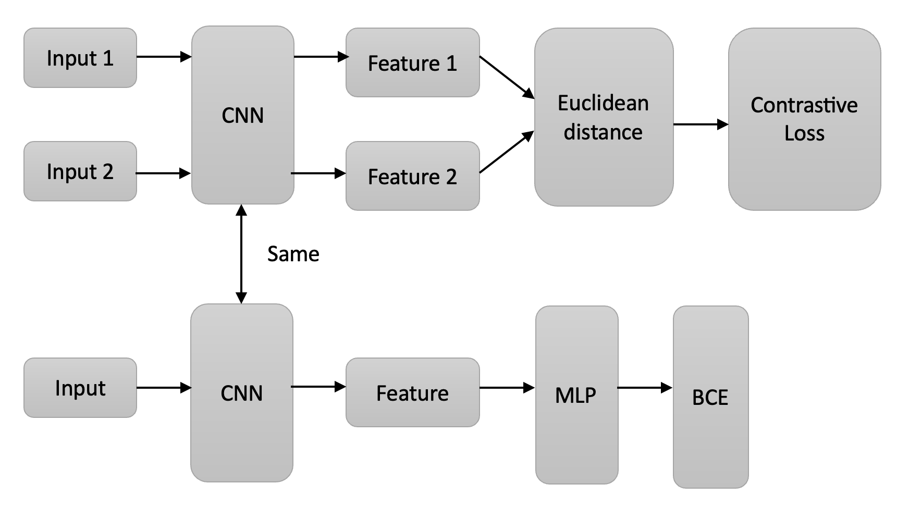
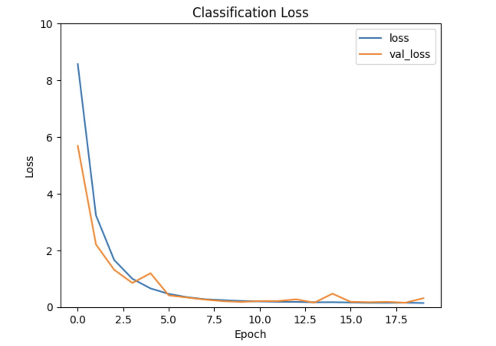
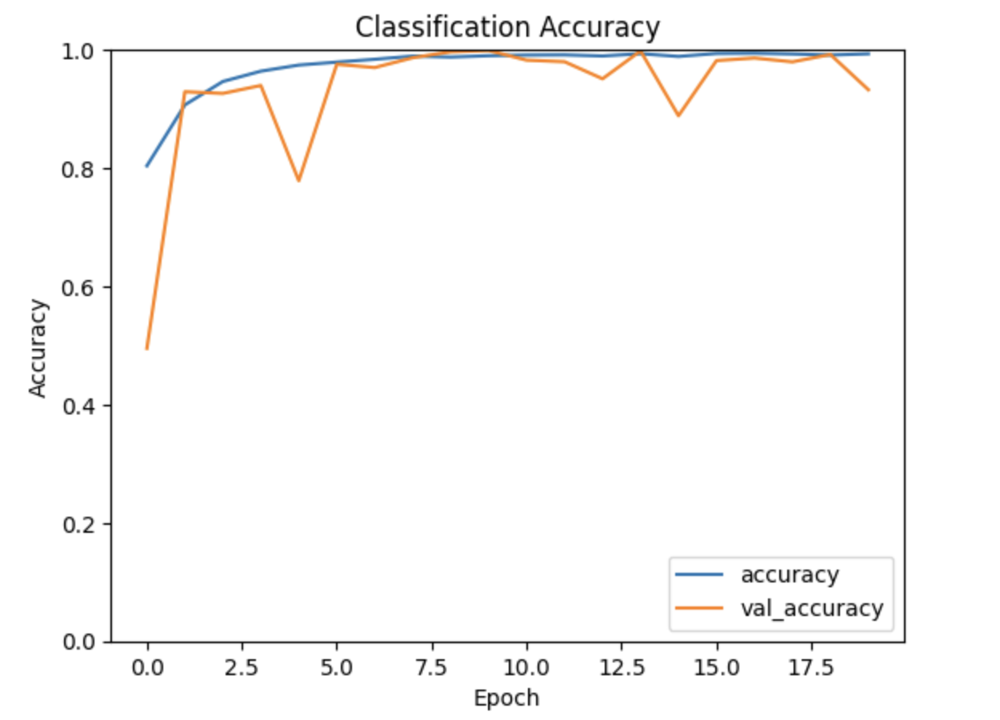

# Alzheimer's Disease Detection with Siamese Networks using ADNI Brain Data

Author: Siew Hui Chun (s4724246) 

## Introduction to Siamese Neural Network 

Siamese neural networks are a class of neural network architectures that contain two or more identical subnetworks. The weights between these subnetworks are tied using the same parameters at each layer.
Siamese networks are used for comparing inputs and learning similarity functions. Often, Siamese networks are used for tasks like facial recognition, signature verification, and image similarity comparison.

During training, two input examples are fed through the twin subnetworks. Their outputs are then compared using a contrastive loss function, which pulls similar pairs closer together and pushes dissimilar pairs apart in feature space. This allows the model to learn a useful representation for comparing inputs.

Some key advantages of Siamese networks are:
- They can learn a similarity metric from the given data.
- They learn compact and meaningful feature representations of the input data.
- There are fewer parameters to train since the subnetworks share weights.
- Useful for verification and recognition tasks.

## Design Approach

### Data Preparation

**Dataset:**
Dataset used in this code can be downloaded at [ADNI dataset for Alzheimer’s disease](https://cloudstor.aarnet.edu.au/plus/s/L6bbssKhUoUdTSI)  

**Create pairs of images**
Takes input images x and labels y and creates pairs of images for training a Siamese neural network. It first gets indices of images per class. Then, each image creates a positive pair with a random image of the same class and a negative pair with a random image of a different class. The positive and negative pairs are concatenated together into pairs of variables. Corresponding 0/1 labels are generated for whether a pair is positive or negative.

**Train and Validation split:**
To create the training and validation sets, the pairs of images were split 80/20, with 80% used for training and 20% reserved for model validation. This ensures sufficient data is available to accurately train the model and set aside a validation dataset to assess performance during training and identify potential overfitting.

### Siamese Neural Network

**Siamese Network Architecture:**
1. There are two identical CNN subnetworks (Siamese networks).
2. Input 1 and Input 2 fed into identical CNN. 
3. CNN extracts features from the respective input image. Let's call them Feature 1 and Feature 2.
4. Feature 1 and Feature 2 are then fed into a distance calculation block, typically Euclidean distance. The distance represents the similarity between the two feature vectors.
5. This distance is then fed into a contrastive loss function which brings similar pairs closer and dissimilar pairs further apart in feature space. (The contrastive loss uses Euclidean distance between embedded image features to determine similarity and train the Siamese network to recognize it. Similar pairs have low distances, and dissimilar pairs have high distances.)
 
The following are the results for the Loss plot for the Siamese Network:

The model was trained for 20 epochs. The training loss started at around 2.5 and decreased to approximately 0.2 by the end of training. This indicates that the model was able to learn from the training data to improve at distinguishing between similar and dissimilar pairs.

The validation loss mostly followed the downward trend of the training loss, indicating the model was generalising well. However, there were slight fluctuations in validation loss during epochs 4-9 and 20-22. These temporary increases suggest some overfitting is occurring.

The consistent downward trajectory of the training and validation loss shows that the model progressively improves over time at the similarity learning task. The contrastive loss reaching a low value by the end of training suggests that the model has learned an effective representation to compare image pairs.

### Classification

**Data:**
All images are used for the classification (Not pairs of images).

**Classifier Architecture:**
1. The input image goes into the same CNN architecture used in the Siamese network.
2. This CNN extracts a feature vector from the input image. Let's call it Feature.
3. Then, Feature is fed into an MLP (Multi-Layer Perceptron) for classification.
4. The MLP outputs class probabilities for the input image.
5. The probabilities are compared to the true labels using binary cross-entropy loss (BCE) to train the classifier.

The following are the results for the Accuracy and Loss plots for the Classifier:

**Loss Plot:**
The classifier model was trained for 20 epochs on all the images. The training loss decreased smoothly throughout training, starting around 8.5 and reducing to around 0.2 by the end. This indicates the model was effectively learning from the training examples.

However, the validation loss was more fluctuating during training. It decreased from an initial 6.0 down to 0.3 but had ups and downs. The fluctuations in validation loss suggest the model was slightly overfitting. But importantly, training and validation loss converged to low values by the end of training. The downward trend demonstrates the model could leverage the representations from the Siamese network and further learn to perform accurate classification.

**Accuracy Plot:**
The classification model training accuracy increased over the 20 epochs, smoothly improving from around 0.8 to 0.98. This shows the model was able to fit the training data well.

However, the validation accuracy told a different story. The validation accuracy fluctuated vigorously between 0.5 and 0.95 in the first five epochs. This indicates that the model was unstable and overfitted heavily to the training data. From epochs 10 through 20, the model improved. The validation accuracy stabilised more in the 0.8 to 0.95 range. The model seemed to find its footing and settle into a solution. But some slight back-and-forth fluctuations remained, suggesting overfitting was still an issue, just less severe. 

The gap between training and validation accuracy demonstrates the model has overfitted to the training data. The accuracy is still reasonably high on the validation set.

_(I have tried multiple ways to fix this issue, such as adjusting the CNN model architecture (adding more convolution layers, increasing the number of filters, using batcha normalisation and tuning the L2 regularisation). Unfortunately, it is only a slight improvement and still is fluctuating.)_

## Note on running the code
This model requires significant computing resources to train the Siamese neural network and classifier in a reasonable time. Using Google Colab or another GPU-enabled cloud computing platform is highly recommended. Running locally on a CPU will likely take many hours to complete and risk overheating your computer.

The paired image dataset and neural network architectures have high memory usage and computational demand. Using a GPU with at least 12-16GB RAM is highly recommended if you want to try out this code. Utilising platforms such as Colab Pro can also increase processing speed.

## Dependencies
* Python 3.9 or higher
* NumPy 1.23 or higher
* TensorFlow 2.10 or higher
* Matplotlib 3.8 or higher
* scikit-learn 1.1 or higher

## References
* https://keras.io/examples/vision/siamese_contrastive/
* https://towardsdatascience.com/siamese-networks-introduction-and-implementation-2140e3443dee
* https://github.com/wangshusen/DeepLearning/blob/master/Slides/16_Meta_2.pdf
* https://towardsdatascience.com/one-shot-learning-with-siamese-networks-using-keras-17f34e75bb3d
* G. Koch, R. Zemel, R. Salakhutdinov et al., “Siamese neural networks for one-shot image recognition,” in ICML deep learning workshop, vol. 2. Lille, 2015, p. 0.

